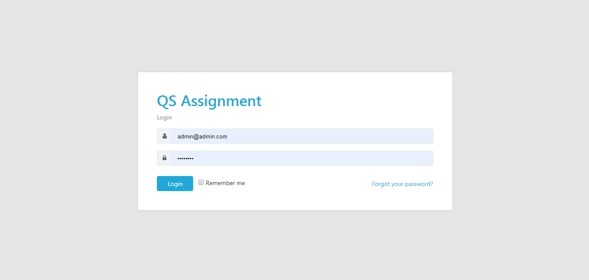
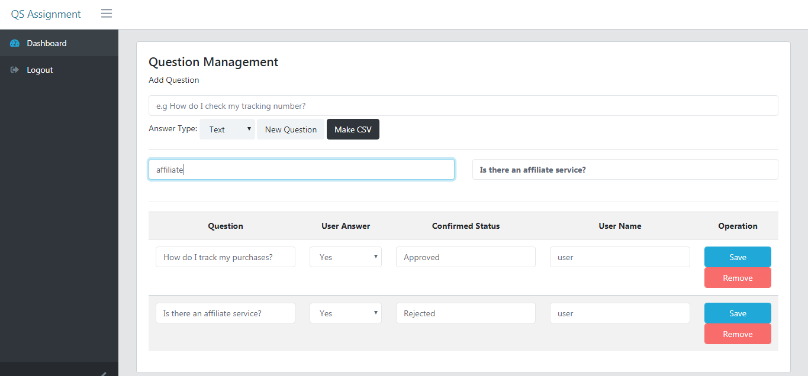
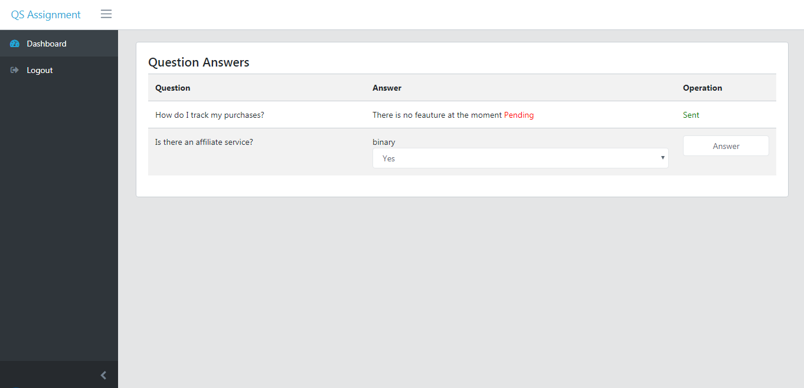
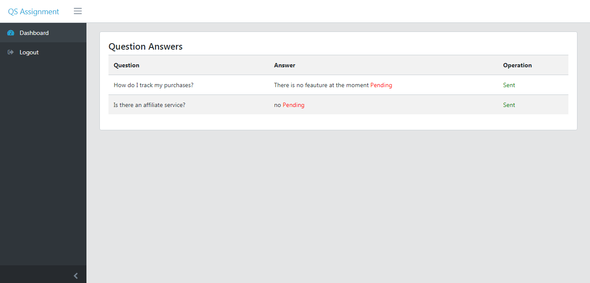
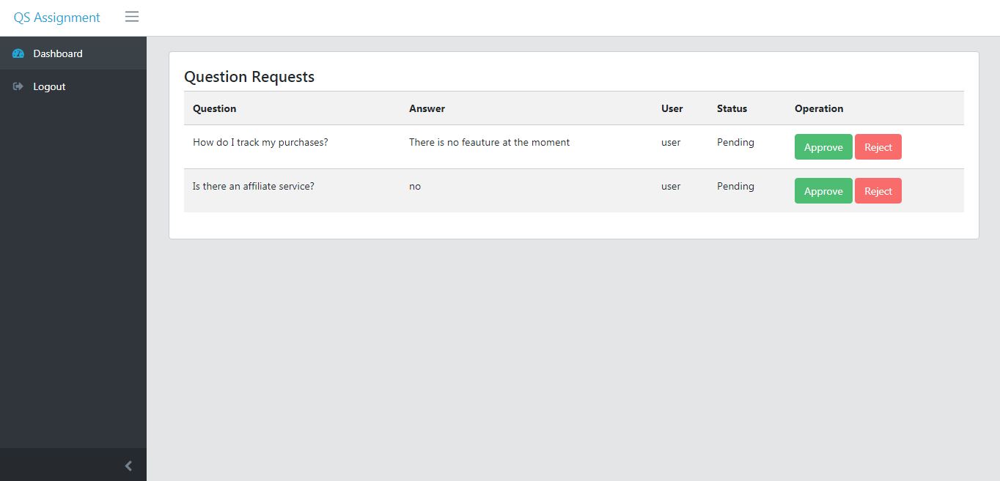
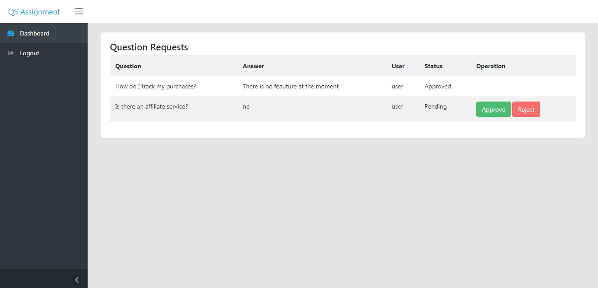
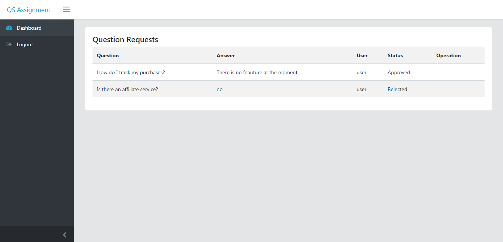
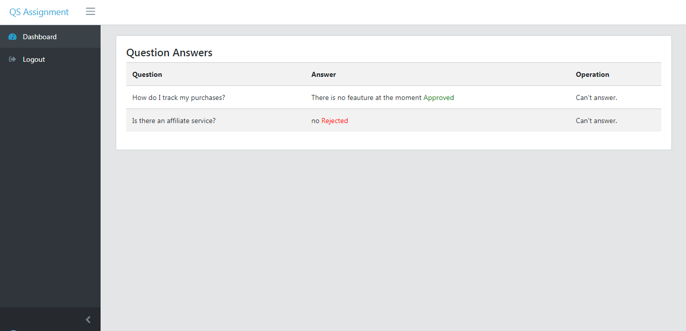

# QS Assignment

This is a test case assignment for a questioning system using Laravel.

## What's inside

- QS Admin Dashboard with an admin user (_admin@admin.com/password_), a mod user (_mod@mod.com/password_) and a plain user (_user@user.com/password_) 
- Admin user can: Create, edit and delete questions
- Mod user can: Approve, Reject answerts from plain users
- Plain user can: Answer the questions

## Screenshots

## How to use

- Clone the repository with __git clone__
- Use Xampp as your default web server and start _Apache_ and _MySQL_
- Import the _assignment_ database into your _phpmyadmin_
- Open command line within the laravel folder and run the server by typing: __php artisan serve__
- Head over to _localhost:8000_ and use the credentials to sign in
- That's it: launch the main URL or go to __/login__ and login with default credentials __admin@admin.com__ - __password__

## License

MIT

## Author 

George Zafiris

